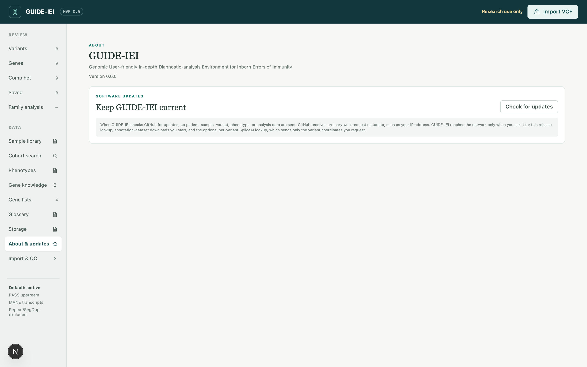

# Install it on your computer

On a Mac, open the GUIDE-IEI application to use the local review workbench.
The self-contained edition includes its Python runtime and prebuilt interface;
older source-payload packages prepare a writable working environment on first
use. Annotation datasets are installed separately through the workbench.

Most Mac and Windows users can follow the graphical instructions below.
Linux users and users comfortable with a terminal can use the command-line
route in the appendix.

## Requirements

- A reasonably modern computer: **Mac running macOS 13 or newer** (Intel or
  Apple Silicon), **Windows 10/11** (via WSL2, which the launcher arranges),
  or **Linux**.
- **Disk space**: plan datasets, preparation workspace, and sample storage
  separately ([the next chapter](03-datasets.md) provides
  the planning table). Datasets may reside on an external SSD when the
  internal drive is small.
- **The managed Mac installation needs no administrator rights** when installed
  in your own `~/Applications` folder. The self-contained app includes its
  runtime; workbench state defaults to `~/.iei-variant-review/`. Older
  source-payload packages also keep writable application files under
  `~/Library/Application Support/GUIDE-IEI/`. On a clean Windows computer,
  installing WSL2/Ubuntu is a one-time administrator-approved Windows change.
  Annotation also needs a working Linux container runtime. Docker Desktop with
  WSL integration is the simplest Windows option. Optional native tools added
  through an existing package manager are outside the managed folder.

## Get the software

**Mac:** open the [GUIDE-IEI releases page](https://github.com/yimingluo-md/guide-iei/releases)
(the initial self-contained beta is Apple Silicon only; prereleases do not
appear at GitHub's “latest stable” link). Choose the signed/notarized
`GUIDE-IEI-macOS-<version>-arm64.dmg` when available. For a `.dmg`, open it
and drag **GUIDE-IEI** into **Applications**; for a `.zip`, unzip it first,
then move **GUIDE-IEI.app** into Applications. A standard account can instead
use its own `~/Applications` folder. `arm64` means Apple Silicon; it does not
run on Intel. Intel users can use the source workflow below; Intel CI previews
are test artifacts, not supported standalone installers.

**Windows:** on the [GUIDE-IEI GitHub page](https://github.com/yimingluo-md/guide-iei),
use the green **Code** button → **Download ZIP**, then choose **Extract All**
and place the extracted `guide-iei` folder somewhere ordinary. Do not run the
launcher from inside the ZIP preview. Avoid cloud-synced locations
(OneDrive, Dropbox, iCloud Drive): sync services interfere with working files.

### Which file do I open?

| Installation | Start here |
|---|---|
| Standalone Mac DMG or ZIP | Install it as described above, then double-click `GUIDE-IEI.app` |
| Mac source ZIP or Git checkout | Open `desktop/macos/GUIDE-IEI-Workbench.command` inside the complete extracted repository |
| Windows source ZIP | Open `desktop/windows/GUIDE-IEI.bat`, or use [Start directly in WSL](#windows-start-directly-in-wsl) |
| Linux | Run `bash scripts/start_workbench.sh` after environment setup |

The Mac `.command` launcher also performs first-use setup. Do not move it out
of the repository. The source-tree `.app` is a development template, not the
standalone release: macOS can isolate it from its sibling files. If it says it
was separated from its repository, use the `.command` launcher or the standalone
release. A downloaded `.command` can also receive a macOS security warning;
neither entry point bypasses institutional security policy.

## Mac: double-click GUIDE-IEI

Double-click **GUIDE-IEI.app** wherever you placed it.

- **Self-contained app:** the review interface and Python runtime are already
  included; no Terminal window or separate Python/Node installation is needed.
  Before opening the browser, a native startup window checks the annotation
  engine, prepares missing container tools, and loads the bundled prebuilt VEP
  image. VEP is not compiled or downloaded separately. A clean Mac still needs
  internet access to download the container tools and Linux virtual machine;
  setup time depends on network and hardware. Named stages and **Open Log** show
  progress; compatible existing components are reused. Later launches perform
  readiness checks, not a full reinstall. Engine changes may require preparation
  again; interface-only updates do not reload VEP.
  Choose **Retry preparation** after correcting a failure, or **Quit GUIDE-IEI**
  to cancel preparation safely. The app opens the workbench only after engine
  readiness checks pass; there is no skip option. **Import & QC → Set up
  annotation datasets → Set up annotation engine** remains available for repair.
  Large annotation databases
  are never downloaded by startup setup: select them inside Import & QC.
  Use **Quit GUIDE-IEI** to stop
  the app; closing its browser tab does not stop it.

The self-contained Mac app has a small control window with **Open Workbench**,
**Open Log**, and **Quit GUIDE-IEI**. Click its Dock icon to bring the controls
back. You can also use **Quit GUIDE-IEI** at the top of the web interface.
Quitting asks for confirmation: save or export any **Review once** work in all
tabs first. Running annotation jobs and dataset downloads are interrupted;
queued annotation jobs resume on the next launch. Retry interrupted work from
the workbench. Imports, storage moves, and annotation-environment preparation
must finish before quitting. Docker is left running for other applications.
The browser tab itself stays open with a shutdown message; close that tab.
To start again, open the installed GUIDE-IEI app, not the old browser tab.

Opening the same packaged build again reopens its running workbench. If an
older or different build is already running, the app offers to open that
workbench instead. Quit the old copy before launching the new one; GUIDE-IEI
does not stop an unknown process just because it occupies the same port.

If an alert says **“This source-tree app was separated from its repository”**,
you opened the old source launcher, not the self-contained app. Open the app
installed from the latest standalone DMG directly from Applications. Replace
any old Dock shortcut with that app. This is a launcher-selection/translocation
issue, not a failed Quit operation.

- **Older source-payload ZIP or source checkout:** the first launch prepares
  the environment. A Terminal window opens
  and reports progress while native Python, Node.js, interface dependencies,
  and the container runtime are installed into managed user folders and a
  smoke test verifies the wiring. No administrator password, Xcode, Homebrew,
  Docker Desktop, or preinstalled bioinformatics software is required. The
  first launch downloads several components and can take several minutes.
- The browser then opens the workbench at **`http://127.0.0.1:3000`** — a
  local address; the workbench runs on your machine and uses the browser
  as its display.
- **For Terminal-based launchers, keep the Terminal window open.** Closing
  it stops the local workbench service. Later launches skip the preparation.

Signed and notarized builds do not require a manual security override.
If macOS blocks an app, verify the download and its signing status; on a
managed computer, ask your administrator. Do not disable security controls.

## Windows: double-click GUIDE-IEI and follow the one-time WSL2 prompt

The Windows launcher is not yet signed with a trusted publisher certificate.
Windows security may block it. If that happens, use the separately supported
[direct WSL start](#windows-start-directly-in-wsl) below on a machine where
running this software in WSL is permitted. Do not turn off Windows security
or change an institution's execution policy to run GUIDE-IEI.

GUIDE-IEI runs inside **WSL2** (a Linux environment Windows provides) with
Ubuntu. The launcher checks this environment before copying or starting
anything:

1. In the fully extracted GUIDE-IEI folder, open `desktop` → `windows` and
   double-click **GUIDE-IEI.bat**. A window opens immediately and remains
   visible if anything needs attention.
2. If WSL2 with Ubuntu is missing, the launcher offers to start the supported
   installation with administrator approval. Accept it, or open PowerShell as
   Administrator and run the exact line shown:

   ```
   wsl --install -d Ubuntu
   ```

   Restart Windows if asked. Open **Ubuntu** once from the Start menu and
   create its requested Linux username and password, then double-click
   **GUIDE-IEI.bat** again. Docker Desktop's internal Linux distribution does
   not count as Ubuntu and cannot host the workbench.
3. To run VEP annotation, install
   **[Docker Desktop](https://www.docker.com/products/docker-desktop/)**
   and enable **Settings → Resources → WSL integration** for the selected
   Ubuntu distribution. You may skip Docker when you only need to import and
   review a VCF that is already annotated; the launcher will explain this
   instead of installing another Docker engine without asking.

The first successful launch copies GUIDE-IEI into the Linux filesystem (where
large indexed files are read much faster than across the Windows/Linux
boundary), removes any Windows-specific build files from that copy, prepares
missing Ubuntu packages and user-space Node.js, and opens the workbench in your
normal Windows browser. Ubuntu may ask for the password created during its
first-run setup. Keep the launcher window open while you work; closing it stops
the workbench. If startup fails, the window remains open and prints the path to
a diagnostic log under `%LOCALAPPDATA%\GUIDE-IEI\logs`.

## Windows: start directly in WSL

This starts the same workbench without the Windows `.bat` or PowerShell
launcher. No GUIDE-IEI account or Microsoft-account sign-in is required by the
workbench itself; WSL, Store, and organizational requirements are separate.

### One-time Windows setup

In **Administrator PowerShell**, install Ubuntu if it is missing:

```powershell
wsl --install -d Ubuntu
```

Restart if requested, open **Ubuntu** from Start, and create the Linux username
and password. If the Store download is unavailable or stalls, Microsoft also
documents `wsl --install --web-download -d Ubuntu`. See
[Microsoft's WSL installation instructions](https://learn.microsoft.com/en-us/windows/wsl/install).

In ordinary **PowerShell**, check the distribution and start it:

```powershell
wsl --list --verbose
wsl -d Ubuntu
```

Use the exact distribution name listed if it is not `Ubuntu`. Its VERSION must
be **2**; Docker Desktop's own distribution is not suitable. These are Windows
commands, not commands to paste into Ubuntu. See
[Microsoft's WSL command reference](https://learn.microsoft.com/en-us/windows/wsl/basic-commands).

### First GUIDE-IEI start inside Ubuntu

If the Windows launcher already installed `~/guide-iei`, use that folder and
skip cloning. Otherwise, run these commands **in Ubuntu**, one line at a time:

```bash
sudo apt-get update
sudo apt-get install -y git
git clone https://github.com/yimingluo-md/guide-iei.git ~/guide-iei
```

Do not delete or overwrite an existing folder if Git reports that it exists.
Then, in the same Ubuntu window:

```bash
cd ~/guide-iei
bash scripts/setup_environment.sh --install
bash scripts/start_workbench.sh
```

Ubuntu may request your **Linux password**; no characters appear while typing.
For annotation, start Docker Desktop and enable WSL integration for this Ubuntu
distribution before setup. Advanced Linux users may use their own working
container engine instead. File preparation/indexing also needs native file tools
or a container backend; setup reports what is missing.

Open **http://127.0.0.1:3000** in your normal Windows browser. Direct terminal
starts may not open the browser automatically. Keep Ubuntu open; **Ctrl+C** stops
the workbench. Diagnostics appear in Ubuntu, not the Windows launcher's log folder.

### Every later start

Open **Ubuntu** from Start (or run `wsl -d Ubuntu` in PowerShell), then:

```bash
cd ~/guide-iei
bash scripts/start_workbench.sh
```

Use the same distribution, Linux user, and repository each time to find the
same library. Do not make a second installation merely because the browser
failed to open; check the Ubuntu window first.

**Windows security note.** SmartScreen reputation warnings and Smart App Control
blocks differ; there is no universal “Run anyway” step. Trusted-publisher signing
is planned, not implemented. Signing requires a trusted publisher certificate,
not a user's Microsoft-account sign-in. If policy also prohibits WSL or this
software, ask IT for approval. See
[Microsoft's Smart App Control FAQ](https://support.microsoft.com/en-us/windows/security/threat-malware-protection/smart-app-control-frequently-asked-questions).

## What the first launch prepares

For the self-contained Mac app, Python, the built review interface and a
compressed VEP engine image are already bundled. The startup window installs
missing container tools/VM and loads that engine; it does not install Node,
compile VEP, or download annotation databases. The details below describe the
source-tree/command launchers, which also support other platforms.

The preparation step is a **setup check with an installer attached**. It
reports a green `[ OK ]` line for everything already present and installs
supported missing prerequisites. A Mac needs no administrator rights;
Ubuntu/WSL2 may request the Linux user's password for system packages:

- **Python and its single dependency** — on a Mac, a pinned native runtime is
  verified and installed in the managed tools folder; on Ubuntu/WSL2, the
  standard `python3` and `python3-yaml` packages are installed when absent.
- **Node.js** (runs the workbench interface) — when no suitable version is
  found, the official build is placed in the managed tools folder, leaving
  the system installation untouched.
- **A container runtime** — the annotation engine (Ensembl VEP and its
  plugins) runs inside a Linux container, so no bioinformatics software is
  installed on the machine itself. An existing Docker Desktop or Podman
  installation is detected and used; on a Mac without one, a small, pinned,
  checksum-verified container stack is set up in the managed folder — no
  Homebrew, no administrator password. On Linux and inside WSL a container
  runtime is a system component that needs administrator rights, so the setup
  never installs one silently: it prints the exact command (Docker's
  convenience script or your distribution's package) and runs it only after
  you type `y` at the terminal — the launchers' automatic "yes" does not
  cover this step. Unattended provisioning that you control can pass
  `--yes-privileged` to `scripts/setup_environment.sh` explicitly.
- **Native bcftools/tabix** (optional, recommended) — accelerates file
  operations severalfold; added automatically when a package manager is
  available.
- **A smoke test** — checks command construction and synthetic postprocessing
  without annotation downloads. It does not execute the real VEP stack or
  verify dataset completeness; run the control-variant regression after setup
  ([QC checks](10-quality-control.md)).

Its summary looks like this:

```text
== IEI pipeline environment check — macOS (arm64)

[ OK ] core tools (tar, curl/wget, awk, sed, sort, gzip)
[NOTE] git is unavailable without Xcode Command Line Tools (not required by the standalone app)
[ OK ] python3 3.13.15 at ~/.iei-variant-review/tools/bin/python3 (>= 3.9)
[ OK ] PyYAML importable (config parser dependency)
[ OK ] node v26.7.0 (>= 22.13)
[ OK ] webui/node_modules present
[ OK ] native bcftools/tabix/bgzip found — htslib I/O runs without container overhead
[WARN] disk: insufficient space for the selected reference setup
       (see the dataset planning table and Storage page)
[ OK ] pipeline smoke test passed (test/test_dry_run.sh)

== Summary: 7 ok, 1 warning(s), 0 to fix
Environment ready.
```

A `WARN` line, like the disk-space warning above, is advice rather than a
failure — the summary still ends `Environment ready` when nothing needs
fixing. The check may be repeated without consequence — it changes nothing
that is already correct — and re-running it (appendix below) is the first
move whenever the installation appears broken.

## Windows only: WSL2 disk space — plan before downloading datasets

WSL2 keeps its entire Linux filesystem in a single virtual-disk file that
resides on the Windows system drive (`C:`) by default and **grows as data
are added**. Once the annotation datasets are installed, this file reaches
the sizes described in the [next chapter](03-datasets.md). The drive hosting
WSL must accommodate datasets, preparation workspace, and sample data together.

When `C:` is too small, there are two good options and one fallback:

- **Place WSL on a larger internal drive** (preferred). Plan this before
  downloading datasets. Recent WSL versions offer a `--location` option for a
  new distribution; check `wsl --help` and Microsoft's command reference for
  your installed version. Relocating an existing distribution is an advanced
  backup-and-restore task; use the safeguards below.

- **Use an external SSD for WSL.** Arrange relocation to a suitable NTFS
  volume with the same backup safeguards. The drive must remain connected;
  speed depends on the SSD, enclosure, and connection.

- **Fallback: datasets on an external drive via `/mnt`.** The **Storage**
  page inside the application can place the annotation datasets at any
  path, including a Windows drive visible in WSL as `/mnt/d/...`. This
  works, but it crosses the Windows/Linux boundary, and the large indexed
  reference files (dbNSFP, SpliceAI) pay the largest penalty — annotation
  becomes noticeably slower. Prefer one of the relocation options when
  possible.

For an existing WSL distribution, ask IT to help with relocation. **Do not run
`wsl --unregister` as a troubleshooting shortcut:** it permanently deletes the
distribution's data. Before any migration, stop jobs, make a verified backup,
test restoration under a separate distribution name, and retain the original
until the restored library, Linux user, permissions, and Docker integration work.

## Common first-run problems

| Symptom | Cause and remedy |
|---|---|
| macOS blocks GUIDE-IEI | Verify the download and whether that build is signed and notarized. Use a verified build; on a managed computer, consult your administrator rather than disabling security controls. |
| The workbench page does not load | Keep the self-contained app running and check **Open Log** in its menu. For a Terminal-based launcher, keep its Terminal window open and check for error lines. |
| A `[FIX]` line about the container daemon | The runtime is installed but not running. On macOS, opening the app or running setup with `--install` attempts to start the selected local Docker Desktop or existing Colima engine. The standalone app waits for readiness before opening review. If startup fails, follow the displayed instructions and startup-log path. Doctor-only `--check` never starts it. On Windows/Linux, follow the printed start command. |
| Application sharing needs attention | The engine may already be installed, but the container cannot see the app. Setup automatically backs up and repairs the selected Colima profile's sharing while preserving existing settings. If other containers are running, finish those workloads in the container manager, then choose **Retry preparation**. Docker Desktop users may need to allow Applications in **Settings → Resources → File sharing**. No Terminal command, dataset deletion or VEP rebuild is needed. |
| Import or annotation is unexpectedly slow | Check the setup summary's note about native bcftools/tabix; without them, file operations run through the container at 5–20× cost. |
| Windows: the launcher reports that WSL2/Ubuntu is not set up | Accept its installation offer, or run `wsl --install -d Ubuntu` in Administrator PowerShell (step 2 above), restart, finish Ubuntu's first-run setup, and launch again. |
| Windows: Docker Desktop is installed but annotation is unavailable | Start Docker Desktop and enable Settings → Resources → WSL Integration for the Ubuntu distribution named by the launcher. Import and review of already annotated VCFs still works without Docker. |
| Windows: startup fails for another reason | Read the explanation kept open in the launcher window. Its timestamped diagnostic log is under `%LOCALAPPDATA%\GUIDE-IEI\logs`. |
| The folder lives in OneDrive/Dropbox and behaves oddly | Cloud-synced folders may cause synchronization conflicts, poor performance, or incomplete working files. Use an ordinary local folder whenever possible. |
| Uncertain what state the installation is in | Run the setup check from the appendix below (no options). It changes nothing and reports exactly what is present and missing. |

For blocked Windows launchers use [Start directly in WSL](#windows-start-directly-in-wsl).
For dataset, mount, import, and stale-interface errors, see
[Troubleshooting](../TROUBLESHOOTING.md).

## Keeping GUIDE-IEI up to date

Updates are delivered as releases and installed from inside the
application. Open **About & updates** in the left navigation:



- The page shows the installed version. **Check for updates** asks
  github.com for the newest release and shows its description — what
  changed, in plain terms. The lookup happens only when you click, and
  when GUIDE-IEI checks GitHub for updates, no patient, sample, variant,
  phenotype, or analysis data are sent. GitHub receives ordinary web-request
  metadata, such as your IP address. GUIDE-IEI reaches the network only on
  your explicit request: this lookup, dataset downloads you
  start, and the optional per-variant SpliceAI lookup, which sends only
  the variant coordinates you ask about.
- **Install** downloads the release, verifies its checksum, and replaces
  the software's own files — nothing else. Annotation datasets, the
  sample library, review data, and your edited configuration are never
  touched. When a release changes the configuration, your file is kept
  as-is and the new version is saved beside it
  (`annotation.config.yaml.new`) for you to compare at leisure.
- A restart finishes the update; the page offers the button. When a
  release changed the interface's underlying components, the page says
  so and asks you to **close the launcher window entirely and start
  GUIDE-IEI again** — that first start installs the new components and
  takes about a minute longer.
- The version you were running is kept. If anything about the new
  version misbehaves, **Return to it** on the same page restores the
  previous software exactly — your configuration file and data stay as
  they are at that moment.

Updating never runs while an annotation job, import, or storage
migration is in progress — finish or cancel those first.

On a clean Git checkout, stop jobs, back up the library, inspect `git status`,
then use `git pull --ff-only`. If local edits or divergent history prevent it,
stop and reconcile them; do not reset the repository or commit private
configuration just to make the update succeed. If dependency manifests changed,
run `npm ci` inside `webui/`; the launcher detects a changed Git commit and
rebuilds the interface. See [Backup and restore](../SAMPLE_LIBRARY_AND_STORAGE.md#backup-and-restore).
The two routes do not mix — after using the in-app updater, keep using
it (the folder no longer matches git's records).

## Uninstalling

First follow [Backup and restore](../SAMPLE_LIBRARY_AND_STORAGE.md#backup-and-restore).
Then remove `GUIDE-IEI.app` and
`~/Library/Application Support/GUIDE-IEI/` to remove the installed Mac
application. The separate `~/.iei-variant-review/` folder contains managed
tools **and the sample library**; do not delete it merely to reinstall the app.
Custom storage roots and the bootstrap registry also remain. Colima/Lima VMs,
container images, and packages installed through Homebrew, conda, or apt are
separate. Remove only resources dedicated to GUIDE-IEI, using their own
management tools, after checking that other applications do not use them.
A TSV export is not a complete library backup.

## Appendix: the terminal route

Everything the launcher does can be typed instead — the route of choice on
Linux, on servers, and for anyone at home in a shell:

```bash
git clone https://github.com/yimingluo-md/guide-iei.git && cd guide-iei
```

```bash
bash scripts/setup_environment.sh --install
```

```bash
bash scripts/start_workbench.sh
```

Then open **`http://127.0.0.1:3000`** in a browser.
`setup_environment.sh` run without options is the pure setup check —
report only, change nothing. On Linux and WSL2, one component — the
container runtime — is a system package; the installer prints the exact
commands and asks for confirmation before running them.

Technical reference: [Installation & requirements](../INSTALLATION.md)

Next: [Set up the annotation datasets](03-datasets.md)
