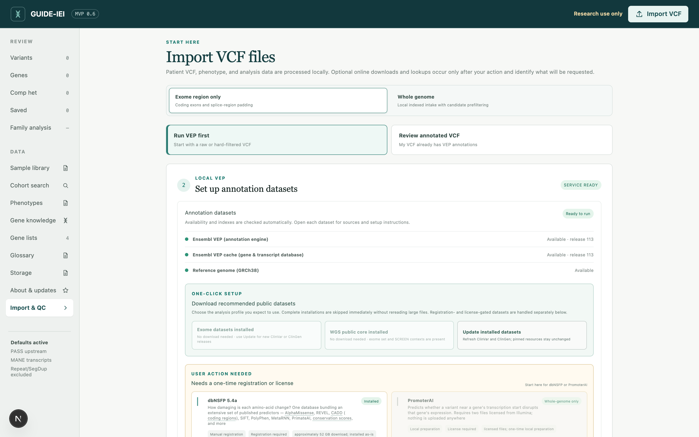
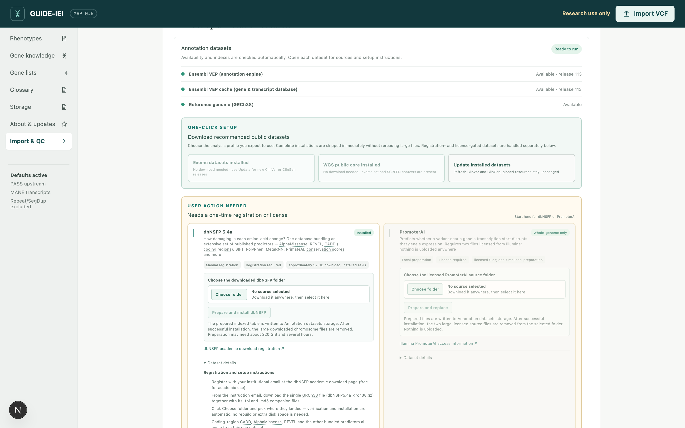

# Set up the annotation datasets

GUIDE-IEI draws on several reference datasets, each answering a different
interpretive question: How common is the variant? What transcript consequence
is predicted? Has it been reported clinically? Does it alter splicing or
expression? Does it overlap a regulatory element active in a relevant cell
type?

This chapter explains which datasets are required, which are optional, and
which require registration or a separate license.

All of this is done inside the application, at **Annotate VCF → Set up
annotation datasets**. Each dataset is presented as a card describing in
plain language what it contributes; this chapter is a tour of those cards.



## Plan disk space first

| Dataset | Size | Contributes |
|---|---|---|
| Core references (VEP cache, genome FASTA, LOFTEE data, region tracks) | ~30 GB | required for all analyses |
| dbNSFP (registration required) | ~52 GB | protein-effect predictors |
| SpliceAI MANE SNV scores | 27 GB | splice predictions |
| ENCODE SCREEN + tissue/immune contexts | ~2 GB | WGS regulatory review |
| PromoterAI (licensed; recommended for WGS) | <1 GB | promoter predictions |
| CADD whole-genome (optional) | ~83 GB | non-coding CADD only |
| LoGoFunc (optional) | ~4 GB | GOF/LOF missense mechanism |
| FuncVEP (optional; licensed) | 4.24 GB source ZIP; 24 GiB free for automatic setup | missense functional-effect scores |

Dataset sizes are approximate and may change between releases. Allow about
110 GB for the recommended exome resources and 150–250 GB for a more complete
WGS installation. Download time varies substantially with internet connection
and storage speed; large installations may take several hours. The datasets
need not reside on the internal drive: the **Storage** page can place them on
an external SSD, and the application verifies free space before each large
download rather than failing partway.

Downloads are fetched from a checksum-verified fast mirror first, with the
official sources as automatic fallback. Interrupted downloads resume rather
than restart.

Before a large first-time transfer, GUIDE-IEI checks that the annotation and
indexing tools are ready. On a clean machine it builds the configured local
tool image at this point, so this one-time preparation happens before any
multi-hour downloads. No separate installation of bioinformatics command-line
tools is required.

## Step 1 — One click for the public datasets

Two actions install everything that is freely downloadable:

- **Recommended for exome** — the core references plus the datasets used in
  exome review.
- **Recommended for WGS** — the exome set plus what whole-genome review
  adds (SpliceAI genome-wide context, the ENCODE SCREEN regulatory data
  with tissue and immune contexts). PromoterAI is also recommended for
  WGS, but because it is licensed it cannot be included in the one-click
  download — it is set up once in Step 3 below.

Progress is reported per dataset. A third action, **Refresh changing
sources**, checks for updated ClinVar and ClinGen resources. Annotation runs
record the source versions used, allowing results from different dates to be
compared explicitly.

During the first installation, two independent groups can download at the
same time, so progress messages may alternate between datasets. Concurrency is
limited to two groups to avoid overwhelming a typical workstation or external
drive. All existing checksum and archive validation remains in place.

If setup is interrupted or stops on an error, completed and verified files are
kept. The setup panel shows the error and a **Retry** action; retrying checks
what is already ready and resumes only the missing work.

## Step 2 — dbNSFP: the one registration

dbNSFP assembles the field's protein-effect predictors (AlphaMissense,
CADD, REVEL, SIFT, PolyPhen-2, and others) into a single resource. It is
free for academic use, but its license does not permit redistribution, so
each user registers once:

1. At **[dbnsfp.org/download](https://www.dbnsfp.org/download)**, request
   the free **academic** access using an institutional email address.
2. The instruction email links the current academic release. Copy the private
   link whose filename ends in `_grch38.gz`, not the similarly named
   `_grch37.gz` link. The release number may change over time. An Outlook Safe
   Link is accepted as-is.
3. On the dataset screen, paste that link into the **dbNSFP** card and select
   **Download and install dbNSFP**. GUIDE-IEI derives the matching `.tbi` and
   `.md5` links, downloads all three files with eight resumable connections,
   verifies the published checksum and index, and installs the resource. The
   private link is removed after the job and is not written to the job log or
   configuration.



## Step 3 — PromoterAI: recommended for whole-genome work

PromoterAI ([Illumina, *Science* 2025](https://www.science.org/doi/10.1126/science.ads7373))
predicts whether a promoter variant alters expression of its gene; scores
range from −1 (under-expression) to +1 (over-expression). The precomputed
scores are **free for academic and non-commercial research** but licensed
by Illumina, so GUIDE-IEI neither downloads nor redistributes them. The
one-time setup:

1. At the
   **[Illumina PromoterAI repository](https://github.com/Illumina/PromoterAI)**,
   follow the access instructions for the precomputed scores: complete the
   non-commercial license agreement, after which the download link arrives
   by email. (Commercial use is licensed separately by Illumina.)
2. Download the two files — `tss.tsv` and `promoterAI_tss500.tsv.gz` —
   into one local folder.
3. On the dataset screen, open the **PromoterAI** card and select that
   folder. Validation and installation are automatic; nothing is uploaded
   anywhere, and the source files are removed only after installation
   succeeds.

PromoterAI annotation applies to whole-genome analysis only, promoters
lying outside the exome's coding scope.

## Step 4 — Optional datasets

- **CADD whole-genome** (83 GB). Coding-region CADD scores are already
  present in dbNSFP; this large download adds CADD for **non-coding**
  positions only, as a complement to SpliceAI, PromoterAI, and cCRE
  evidence in whole-genome review.
- **LoGoFunc**
  ([Stein et al., *Genome Medicine* 2023](https://genomemedicine.biomedcentral.com/articles/10.1186/s13073-023-01261-9)).
  Assigns probabilities to neutral, gain-of-function, and loss-of-function
  classes for missense variants. It may provide a mechanistic hypothesis, but
  it does not establish pathogenicity or functional effect. One click from
  Zenodo (~4 GB).
- **FuncVEP**
  ([Kayaalp et al., *Nature Genetics* 2026](https://www.nature.com/articles/s41588-026-02727-3)).
  Scores the predicted functional effect of GRCh38 missense SNVs. It is a
  licensed resource. Review the archive's
  [PolyForm Strict License 1.0.0](https://polyformproject.org/licenses/strict/1.0.0),
  acknowledge that your intended use is permitted, and select **Download and
  install FuncVEP**. GUIDE-IEI downloads the pinned ZIP resumably from the
  [official Zenodo record](https://zenodo.org/records/20595206). You can select
  an existing official ZIP instead.
  The upstream terms permit qualifying noncommercial use but do not grant
  distribution or software-modification rights. Because Zenodo does not expose a separate
  dataset-license field for this record, confirm that your intended local use
  is authorized.
  Preparation happens entirely on this computer. GUIDE-IEI validates the
  archive, retains only the three FuncVEP score columns, builds a local index,
  and retains an automatic download in Annotation datasets storage. Nothing is
  uploaded or redistributed.
  Although the upstream ZIP also contains ClinVEP columns, GUIDE-IEI does not
  import or display ClinVEP.

FuncVEP scores are emitted only when both the genomic allele and the
version-independent Ensembl gene ID match exactly. The three models are CTI
(clinically trained component predictors included), CTE (clinically trained
predictors and AlphaMissense excluded; AlphaMissense used ClinVar variants for
model selection and tuning), and SP (features from other
variant-effect predictors excluded). A higher score means a stronger predicted
functional effect. It is not a clinical pathogenicity classification, and a
missing score is not evidence that a variant is benign.

Already bundled with the software, requiring no download: the ENCODE SCREEN
cCRE regions, the GRCh37→GRCh38 conversion data, and the gene-knowledge
resources (gnomAD constraint, HGNC, the IUIS IEI classification, and
ClinGen gene–disease validity and dosage). Licensed OMIM data are never
shipped. An authorized user can paste their four private links for local
download and indexing, or select an institution's already-downloaded copy,
under **Import & QC → Set up annotation datasets → Optional add-ons**, after
CADD non-coding and LoGoFunc.

## Verifying the installation

The dataset screen itself is the status display: each card reports
installed-or-missing, with versions. For deeper verification, the
regression panel annotates eight public control variants and asserts the
expected value from every installed predictor
([Quality control](10-quality-control.md)):

```bash
bash scripts/run_annotation_regression.sh
```

Technical reference: [Annotation dataset setup](../DATASET_SETUP.md) and
[Dataset reference](../dataset-reference.md).

Next: [Your first exome](04-first-exome.md)
