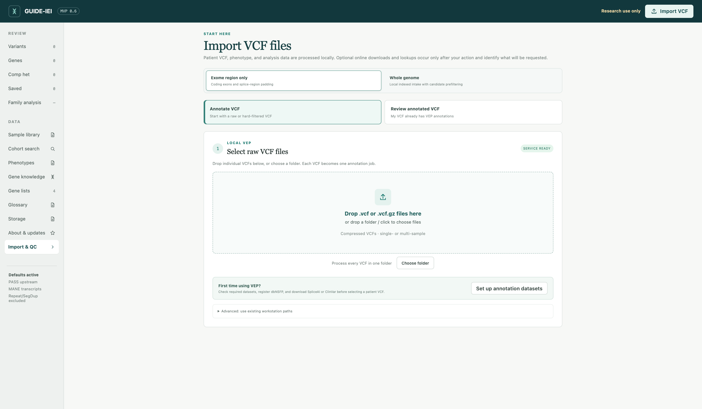
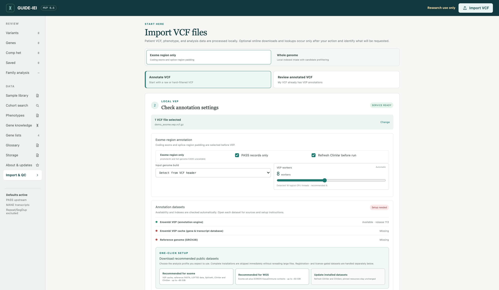
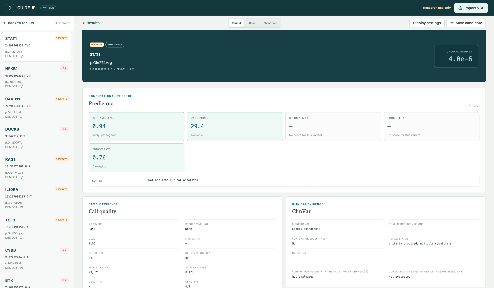
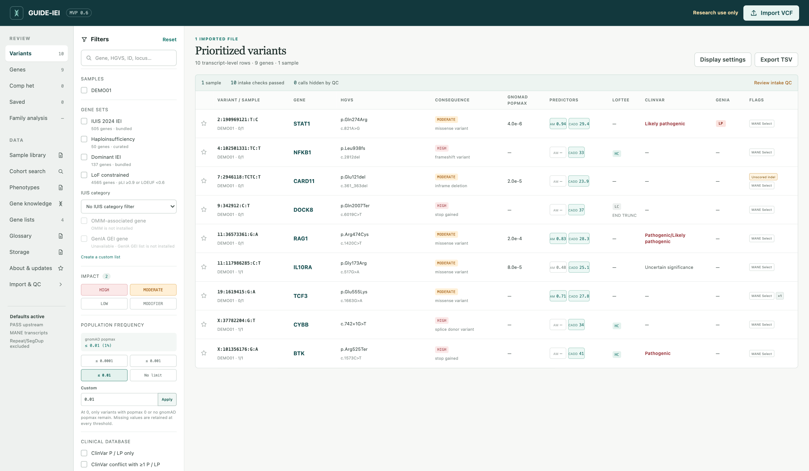

# Your first exome: VCF to reviewed shortlist

This chapter follows a single exome from VCF to a reviewed list of
candidate variants. The first pass takes 20–30 minutes at the screen; the
annotation time depends on the callset, machine, and installed resources.
First-use reference and protein-catalog preparation can take much longer than
subsequent runs; the walkthrough is not a runtime guarantee.

## Prerequisites

1. **GUIDE-IEI installed** and the workbench running
   ([Install it on your computer](02-install.md)) — started with
   `bash scripts/start_workbench.sh`, opened at `http://127.0.0.1:3000`.
2. **Annotation datasets installed** — at minimum the one-click
   **Recommended for exome** set plus dbNSFP
   ([Set up the annotation datasets](03-datasets.md)).
3. **A VCF** — single- or multi-sample, `.vcf` or `.vcf.gz`. GRCh38 is used
   directly; a GRCh37/hg19 file from an older pipeline is converted
   automatically with full quality control
   ([GRCh37 input](../GRCH37_INPUT.md)).

Without a patient VCF at hand, the walkthrough can be followed with the
public-control VCF at `test/regression/annotation_regression.GRCh38.vcf` (sample `REGRESSION`, no
patient data). The screenshots instead use invented demonstration annotations;
they are not the regression panel.

## Step 1 — Import the VCF

The application opens on the **Import VCF** screen, which offers two
routes:

- **Annotate VCF** (the default) — the VCF has not yet been annotated.
  This walkthrough takes this route.
- **Review annotated VCF** — the file was already annotated by GUIDE-IEI or
  a compatible VEP pipeline and only review is needed.

Drag the `.vcf`/`.vcf.gz` file onto the drop zone, or click to browse.

## Step 2 — Confirm readiness and settings

The next screen presents two things.

**Dataset readiness** — every annotation source, marked available or
missing. Required sources must all be present before the run can start;
optional sources (LoGoFunc, CADD) simply annotate when present. If a
required source is missing, the screen links directly to **Set up
annotation datasets**.

**Run settings** — the defaults are appropriate for a first exome run:

- **PASS variants only**: on. Variants flagged as unreliable during
  generation of the VCF (alignment and variant calling) are excluded.
  Records the upstream caller never filtered (FILTER `.`) are retained —
  absence of filtering is not evidence of failure — and a run note is
  recorded when an entire callset arrives unfiltered.
- **Coding + splice regions**: on. Annotation is restricted to coding exons
  and canonical splice sites.

Start the run.

## Step 3 — The run

The run screen reports progress through each stage: input checks, the
ClinVar refresh (unless disabled), reference/protein-catalog preparation,
region filtering, VEP annotation, and post-processing. During preparation,
an activity indicator shows the current stage rather than a fabricated
percentage. When VEP's input total and completed-record count are available,
the bar measures that stage; any remaining-time estimate is approximate.
VEP reaching its total does not mean downstream work is finished: the job
remains active until post-processing and output checks complete. The page
can be left and revisited, as jobs continue in the background.

On completion, open the final VCF selected by the job. Keep its index,
**annotation coverage report** (HTML/JSON), and run manifest with it; see
[which outputs to keep](../OUTPUT.md#which-files-should-i-open-and-keep) and
[Quality control](10-quality-control.md).

## Step 4 — Open the review

The completed run proceeds to review intake. Two defaults deserve
attention:

- **Keep in Sample Library**: on. The reviewed dataset is retained and can
  be reopened at any time without re-importing
  ([Phenotypes and the Sample Library](07-phenotypes-and-library.md)).
- **Include qualifying variants in Cohort Search**: on. The sample's
  qualifying variants join the local cohort index, so future carrier
  searches include this case ([Cohort search](08-cohort-search.md)).

With these defaults, the managed copy and cohort entry are created before the
browser review opens. A typical exome may contain tens of thousands of variant
records but several hundred thousand transcript annotations. GUIDE-IEI keeps
the complete VCF while showing a responsive MANE/PICK/per-gene list; opening a
variant loads its complete transcript table from the indexed source record.

Choose **Review once** to avoid a managed Sample Library copy or Cohort Search
entry. It is not a no-trace mode: annotation outputs, logs, and preparation
caches can remain. After retained intake, each VCF sample may be linked to an individual — new
or existing — or left unlinked.

## Step 5 — The review workspace

The workspace has three areas:

- **Left rail** — navigation among the variant list, gene lists, sample
  library, cohort search, storage, and the glossary.
- **Variant table** — one row per variant: consequence, gene, IMPACT,
  population frequency, and predictor summaries.
- **Detail panel** — selecting a row opens the complete evidence for that
  variant: transcript consequences, predictor scores, ClinVar and ClinGen
  records, the gene's constraint and IUIS context, and the sample's
  genotype evidence.

## Step 6 — Filter to a shortlist

The filter panel narrows the rows already loaded — removing a review filter
restores those rows, not variants removed earlier during annotation or intake.
A reasonable first pass for a suspected
monogenic condition:

1. **Population frequency** — gnomAD popmax ≤ 0.01, or unavailable.
2. **IMPACT** — begin with HIGH and MODERATE.
3. **Gene lists** — restrict to an IUIS IEI gene list or a custom panel
   when candidate genes are in mind, or omit to remain genome-wide.
4. **ClinVar** — optionally surface variants with existing pathogenic or
   conflicting reports first.

Counts depend on the number of samples, transcript display, calling pipeline,
and intake profile. A multi-sample exome can legitimately produce hundreds
of thousands of transcript-level rows. Compare the record, allele, transcript,
and carrier counts in [Quality control](10-quality-control.md), rather than
treating a fixed shortlist size as a pass/fail test.

### Three different places where filtering happens

| Stage | What changes | How to recover excluded variants |
|---|---|---|
| Annotation scope | Which input variants VEP processes (for example coding + splice only) | Rerun annotation from the original VCF with the needed scope |
| Library/cohort intake | Which annotated variants the selected intake profile retains/indexes | Reprepare/reimport from the complete annotated source with revised settings; an identical-file reimport may reuse the existing library version |
| Review filters | Which already loaded rows are visible | Clear or adjust the review filter; no VEP rerun needed |

Keep original inputs and complete annotation outputs. A compact library copy
or a TSV shortlist is not a replacement for them.

## Step 7 — Read the evidence

Work through the shortlist row by row. For each variant, the detail panel
presents the evidence neutrally — GUIDE-IEI assigns no classifications, by
design ([What GUIDE-IEI does](01-what-guide-iei-does.md)). The meaning of
each evidence block, and its limits, are the subject of
[Reading a variant page](09-reading-a-variant.md); underlined terms
anywhere in the interface are click-to-define glossary entries.

## Step 8 — Where this leads

- **A finding that may explain the phenotype** — confirm through a
  CLIA-certified laboratory before any clinical action.
- **A compelling VUS** — consider contacting a research laboratory with
  expertise in the gene that may be able to conduct the relevant functional
  studies. Recent publications can help identify leading scientists working
  on the gene.
- **No convincing candidate** — retain the case for reanalysis as
  gene–disease associations, ClinVar assertions, and prediction methods
  evolve.

## Continuing

- Analyzing a genome: [Whole-genome analysis](05-whole-genome.md)
- Parental samples available: [Trio analysis](06-trio.md)
- Cases accumulating: [Cohort search](08-cohort-search.md)
