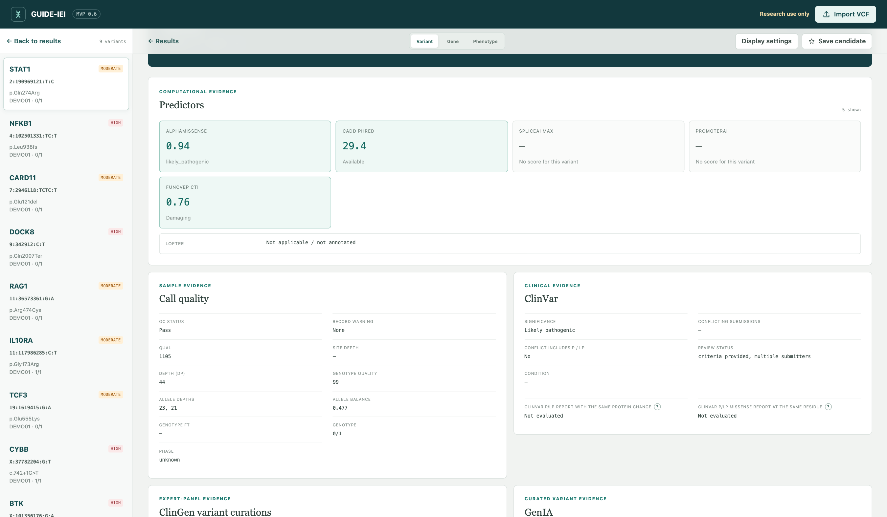

# Reading a variant page

The variant page brings several kinds of evidence together, but those evidence
types are not interchangeable. Population frequency, transcript consequence,
clinical database reports, computational predictions, gene-level constraint,
segregation, and call quality answer different questions.

GUIDE-IEI does not combine them into a classification. The reviewer must weigh
each item in the context of the patient, inheritance pattern, transcript, and
established disease mechanism.

### Reference warnings and session recovery

If a bundled reference cannot load, a warning names the file and offers
**Retry references**. Other references remain available. Its dependent filters
are unavailable, and results pause if one of those filters was already selected;
retry or uncheck it before interpreting results. Missing reference data must
not be interpreted as absence of a gene association or constraint.

**Saved candidates are session-only**, including for Sample Library reviews.
Export the Saved view as TSV before loading another dataset, refreshing, or
closing the tab. Earlier browser-persisted candidate lists are removed when
the updated workbench opens; they are not migrated into a new store.

If a rendering error occurs, **Reopen interface** resets the view and filters
while retaining imported rows, their import summary, and stars in memory.
This also protects **Review once** imports from that interface reset. It does
not protect against tab closure, page refresh, browser failure, or power loss;
retain important source files in the Sample Library.

## Population frequency

[gnomAD](https://gnomad.broadinstitute.org) frequencies, with **popmax** — the highest frequency observed in any
major population — as the headline value.

Which field supplies that headline value depends on what the annotation
carries, and the variant page names it. An explicit gnomAD popmax field is
used when present. The standard GUIDE-IEI annotation does not write one: VEP
is run with `--max_af`, so the value shown is VEP's **MAX_AF** — the highest
allele frequency across 1000 Genomes, ESP, and gnomAD exomes and genomes, with
**Popmax population** naming where it was observed (`gnomADe_NFE`, `AFR`,
`EA`, …). Only when neither exists does the gnomAD global AF stand in. The
sources are never mixed: a supplied popmax is not replaced by a larger MAX_AF
from a small non-gnomAD population. The frequency filter, Cohort Search, and
the whole-genome intake all apply the same preference.

One caveat is specific to this annotation pathway: a blank gnomAD value means
“unavailable from this VEP annotation,” not necessarily “absent from gnomAD.”
Depending on the VEP cache's variant-matching process, a variant without an
rsID may lack frequency data even when the allele is present in the gnomAD
Browser. Verify important candidates by normalized allele in the source;
do not infer rarity from a missing annotation alone.

### Frequency controls

Variant Review defaults to **≤0.01 (1%)**. Choose **≤0.0001**, **≤0.001**, or
**≤0.01**, or enter a **Custom** value such as `0`, `0.00001`, or `1e-5` and
select **Apply**. **No limit** explicitly disables this frequency filter.
The display shows both decimal frequency and percent.

At **0**, recorded zero and missing popmax values remain. This does **not** mean
every retained variant has been confirmed absent from gnomAD. Missing values
remain at every threshold. Cohort Search and intake retain their own adjustable
frequency controls; a review filter cannot recover records excluded at intake.

## Consequence and transcripts

Every transcript consequence is retained, with the preferred consequence
per allele and gene marked (MANE Select first, then MANE Plus Clinical,
then VEP's selection). When a candidate's mechanism is
transcript-dependent — coding in one isoform, intronic in another — the
full transcript table is the appropriate reference. IMPACT
(HIGH/MODERATE/…) is VEP's coarse consequence tier: useful for filtering,
too coarse for judging an individual variant.

**Why a variant can legitimately appear on two transcripts.** Most genes
have exactly one clinically designated transcript (MANE Select), but some
— TCF3 is a classic example — additionally carry a **MANE Plus Clinical**
transcript: an isoform the clinical community needs for interpreting
certain diseases. Both consequences are real and both are retained.
Variants in overlapping genes similarly carry one consequence per gene.
The variant list's **One row per variant** display (on by default) shows
each variant once, represented by its highest-priority transcript, with a
**+N** chip counting the collapsed rows — hover the chip to see them, or
open the variant for the complete transcript table. Turning the toggle
off restores one row per transcript and gene. Nothing is filtered either
way; this is presentation only.

## Loss-of-function evidence

For putative loss-of-function variants (stop-gained, frameshift, essential
splice), three layers are presented:

- **[LOFTEE](https://github.com/konradjk/loftee) HC/LC.** LOFTEE HC indicates
  that a predicted loss-of-function consequence did not trigger one of
  LOFTEE's transcript-specific low-confidence filters. An LC result provides
  a specific reason why the predicted consequence may not behave as a
  straightforward loss-of-function allele. For splice-site variants, consider
  integrating LOFTEE results with SpliceAI evidence where appropriate.
- **The 50-bp rule, recalculated.** For frameshifts, standard LOFTEE
  applies the last-exon-junction 50-bp rule at the variant's own position.
  GUIDE-IEI recalculates it at the **premature termination codon the
  shifted reading frame actually generates**, recording both results with
  provenance. Where the two disagree, the PTC-based value carries the main
  annotation.
- **Frame-restoring haplotypes.** When a sample carries nearby indels that
  jointly restore the reading frame, the combined consequence is evaluated
  per haplotype. Fully restored, phase-confirmed events are excluded from
  the default view; partially restored or phase-unresolved events remain
  visible with their state labeled.

### LOFTEE filters and flags

LOFTEE reports two kinds of qualifier, and the distinction matters. A
**filter** is what demotes a call to LC — a named reason the variant may
escape true loss of function. A **flag** annotates a call (HC or LC)
without demoting it — a caution to weigh, not a verdict. The variant page
expands every code in place; the vocabulary is collected here.

**Filters (the reasons behind an LC call):**

| Filter | What it asserts |
|---|---|
| `END_TRUNC` | The truncation falls in LOFTEE's terminal region, where nonsense-mediated decay may not occur — the shortened protein may be expressed. |
| `INCOMPLETE_CDS` | The transcript's coding sequence is incompletely annotated (no defined start or stop), so the consequence itself is uncertain. |
| `EXON_INTRON_UNDEF` | The transcript's exon–intron boundaries are undefined. |
| `SMALL_INTRON` | The affected splice site belongs to an unusually small intron (< 15 bp), where splicing annotation is unreliable. |
| `ANC_ALLELE` | The alternate allele restores the inferred human ancestral sequence — the "loss" allele is the evolutionarily older state. |
| `NON_DONOR_DISRUPTING` / `NON_ACCEPTOR_DISRUPTING` | The predicted disruption of the donor or acceptor site does not reach LOFTEE's threshold. |
| `RESCUE_DONOR` / `RESCUE_ACCEPTOR` | A nearby in-frame splice site is predicted to rescue the disrupted one. |
| `GC_TO_GT_DONOR` | The allele converts a non-canonical GC donor to the canonical GT motif — more likely to improve splicing than disrupt it. |
| `5UTR_SPLICE` / `3UTR_SPLICE` | The essential-splice consequence lies in an untranslated region rather than coding sequence. |

**Flags (cautions that do not demote the call):**

| Flag | What it asserts |
|---|---|
| `SINGLE_EXON` | The transcript has a single exon, so nonsense-mediated decay — which requires a downstream exon junction — is not expected. |
| `NAGNAG_SITE` | The acceptor lies in a NAGNAG sequence that may permit frame-preserving alternative splicing. |
| `PHYLOCSF_WEAK` | The exon lacks the cross-species conservation pattern expected of protein-coding sequence. |
| `PHYLOCSF_UNLIKELY_ORF` | The exon is coding-like, but the annotated reading frame is not the one best supported by conservation. |
| `NON_CAN_SPLICE` | The affected splice site is non-canonical rather than the usual GT–AG motif. |
| `NO_EXON_NUMBER` | LOFTEE could not determine the exon number needed for its terminal-position assessment. |

An LC call is therefore not a dismissal but a **named, checkable
hypothesis**. `END_TRUNC` invites the question of whether the truncated
terminal portion matters functionally for this protein; `RESCUE_DONOR`
invites inspection of the predicted rescue site; `ANC_ALLELE` invites
checking the allele's population history. Several codes can co-occur, and
the reasoning behind each is inspectable — which is precisely what a
single opaque score would not offer.

## Missense and mechanism predictors

Prediction scores are computational estimates, not functional evidence.
Different tools often share training data, component scores, or
population-frequency features, so agreement among them should not be counted
as multiple independent lines of evidence. A blank score means the predictor
did not score this variant — outside its variant class, outside the installed
dataset's coverage, or not matched to this transcript — never that the variant
is benign. Bear in mind that a score threshold in the filter panel excludes
such unscored variants while it is set (the frequency filter retains them). Use the scores to prioritize
variants and define testable hypotheses, while considering transcript
relevance, gene mechanism, clinical evidence, and the patient's phenotype.
What follows is the complete catalog — what each score measures and how it was
derived — first the standing panel present on every run, then the optional
dbNSFP predictors that are off by default.

### The standing panel

These columns are pulled from the installed dbNSFP release and, where
applicable, the genome-wide sources on every annotation:

- **AlphaMissense** ([Cheng et al., *Science* 2023](https://www.science.org/doi/10.1126/science.adg7492)) — DeepMind's missense classifier: a protein language
  model fine-tuned with structural context from AlphaFold and weak labels
  from human/primate population frequency. Score 0–1, higher = more
  likely pathogenic; the authors' three-way call (likely benign /
  ambiguous / likely pathogenic) is shown as their label, not ours.
  A blank score for the selected MANE transcript can be a normal source-data
  limitation and is not evidence that the variant is benign. GUIDE-IEI does
  not substitute a score from another transcript. See the
  [FAQ](../FAQ.md#why-is-alphamissense-blank-for-the-selected-mane-transcript).
- **REVEL** — an ensemble over thirteen component predictors, trained on
  rare disease-causing versus rare neutral missense variants —
  deliberately rare-versus-rare, to avoid learning allele frequency.
  Score 0–1, higher = more deleterious.
- **CADD** (raw and PHRED-scaled) — genome-wide deleteriousness trained
  to separate evolutionarily fixed (proxy-neutral) from simulated
  variants; not missense-specific, so it also scores synonymous, splice
  region, and non-coding positions. The PHRED value is a rank: 20 means
  the top 1% of all possible SNVs, 30 the top 0.1%. Whole-genome imports
  add the **CADD_WGS** track so non-coding records are scored too.
- **SIFT** and **PolyPhen-2 (HumDiv)** — the classical pair. SIFT scores
  homolog-alignment intolerance (0–1, *lower* = deleterious); PolyPhen-2
  combines alignment and structural features (0–1, higher = damaging;
  the HumDiv-trained model is the standing column, the HumVar model is
  in the optional set below). Retained for continuity with two decades
  of literature more than for standalone accuracy.

The default panel is deliberately this small. In the developer's
judgment, further predictors contribute limited additional information
to interpretation and decision-making — most correlate strongly with the
panel above — while every added column costs annotation time and output
size. Everything else dbNSFP offers is available per job.

### Optional dbNSFP predictors

Any subset can be enabled per job under **Annotate VCF → Additional
dbNSFP predictors**; there is no preset — each predictor is a deliberate
per-job choice. When selecting several, prefer methodological diversity
over near-duplicates (an ensemble, a conservation score, and a protein
language model tell you more together than three ensembles do).

| Predictor | Approach | Direction |
|---|---|---|
| MetaRNN | Recurrent-network meta-predictor over component scores and population frequencies | 0–1, higher |
| PrimateAI | Deep network using common variation in non-human primates as its benign training proxy | 0–1, higher |
| GERP++ RS | Substitution deficit at the nucleotide position | higher = constrained |
| phyloP 100-way | Per-position conservation across 100 vertebrates | positive = conserved, negative = accelerated |
| phastCons 100-way | Probability of lying within a conserved element | 0–1 |
| SIFT4G | SIFT recomputed over broader ortholog alignments | lower = deleterious |
| PolyPhen-2 HVAR | Same classifier, trained Mendelian-vs-common (the authors' recommendation for Mendelian work) | higher = damaging |
| MutationTaster | Bayes classifier over conservation, splice, and mRNA features | probability attached to its disease/polymorphism call |
| MutationAssessor | Subfamily-specific conservation patterns | higher = greater impact |
| PROVEAN | Alignment delta score | more negative = more disruptive |
| VEST4 | Random forest, HGMD-vs-common training | 0–1, higher |
| MetaSVM / MetaLR | SVM / logistic-regression meta-predictors over component scores + allele frequency | higher = deleterious |
| M-CAP | Classifier tuned for high sensitivity on rare missense | 0–1, higher |
| MutPred2 | Pathogenicity probability plus inferred molecular mechanism (which property is altered) | 0–1, higher |
| MVP | Deep residual network | 0–1, higher |
| gMVP | Graph attention over local protein structural/functional context | 0–1, higher |
| MPC | Deleteriousness conditioned on *regional* missense constraint within the gene | higher |
| DEOGEN2 | Adds domain, interaction, and pathway context | 0–1, higher |
| BayesDel (addAF) | Bayesian meta-score integrating allele frequency | higher = deleterious |
| BayesDel (noAF) | The same score without the frequency term | higher = deleterious |
| ClinPred | Boosted trees + random forest trained on ClinVar, frequency-aware | 0–1, higher |
| LIST-S2 | Taxonomy-aware conservation (local identity and shared taxa) | 0–1, higher |
| VARITY R | Trained for rare variants with weighting designed to reduce database circularity | 0–1, higher |
| VARITY ER | The extremely-rare-variant counterpart | 0–1, higher |
| ESM1b | 650M-parameter protein language model, zero-shot (no pathogenicity labels seen in training) | more negative = damaging |
| PHACTboost | Gradient boosting over phylogeny-derived PHACT scores | higher |
| MutFormer | Transformer trained on human protein sequences | higher |
| MutScore | Adds positional clustering of known pathogenic missense | 0–1, higher |
| popEVE | Deep generative evolutionary model (EVE lineage) calibrated against population data | more negative = more severe |

### Reading the panel critically

Three structural caveats apply to any predictor comparison:

- **Circularity.** Many predictors train on ClinVar or HGMD; a variant
  adjacent to known pathogenic entries scores high partly because of that
  adjacency. Their agreement with ClinVar is therefore not independent
  confirmation. ESM1b, popEVE, PrimateAI, and the conservation scores —
  all in the optional set — are the most label-free lines available.
- **Shared inputs.** The meta-predictors (REVEL, MetaSVM/LR, MetaRNN,
  BayesDel, ClinPred) consume overlapping component sets. Agreement
  *among* them counts for less than agreement *across* method families —
  say, a language model, a conservation score, and an ensemble.
- **Frequency double-counting.** BayesDel addAF, ClinPred, MetaRNN,
  MetaSVM, and MetaLR include allele frequency as a feature. After
  filtering on popmax, part of their score restates what the filter
  already established.

### Functional effect (FuncVEP)

When the optional FuncVEP resource
([Kayaalp et al., *Nature Genetics* 2026](https://www.nature.com/articles/s41588-026-02727-3))
is installed, the **Predictors** section shows a **FuncVEP CTI** card by default
for GRCh38 missense SNVs, alongside AlphaMissense, CADD, and the other predictor
cards. CTE and SP can be enabled under **Display settings → FuncVEP models**.
They then appear as additional cards in the same section. All three are 0–1
scores; higher values mean that a damaging
**functional effect** is more likely:

The distributed archive supplies continuous scores. GUIDE-IEI applies the
binary cutoffs recalibrated in the final publication's Supplementary Table 13
and shows **Damaging** or **Neutral** beneath each available score:

- **CTI:** Damaging at ≥0.419606448098318
- **CTE:** Damaging at ≥0.519261866786599
- **SP:** Damaging at ≥0.440940891937106

These are predicted functional-effect labels, not pathogenicity
classifications: **Damaging** does not mean pathogenic/likely pathogenic, and
**Neutral** does not mean benign/likely benign. They are also separate from
the publication's calibrated ACMG PP3/BP4 evidence-strength bands. A missing
score receives no label and is not evidence that the variant is neutral or
benign.

- **CTI** includes features from all available component variant-effect
  predictors, including clinically trained predictors.
- **CTE** excludes clinically trained component predictors and also excludes
  AlphaMissense. AlphaMissense is not categorized as clinically trained here;
  the authors excluded it because its development used ClinVar variants for
  model selection and tuning.
- **SP** excludes every feature derived from another variant-effect predictor,
  providing the least predictor-dependent member of the family.

GUIDE-IEI displays these scores only after the genomic allele and the stable
Ensembl gene ID both match exactly. A gene mismatch or unavailable target is
shown as missing rather than transferring a score between genes. The scores
predict functional impact, **not clinical pathogenicity**; even CTI is not an
ACMG classification or independent clinical evidence. Missing is likewise not
benign. The upstream archive also contains clinically trained ClinVEP models,
but GUIDE-IEI deliberately does not import or display those columns.

### Gain versus loss of function

When LoGoFunc ([Stein et al., *Genome Medicine* 2023](https://genomemedicine.biomedcentral.com/articles/10.1186/s13073-023-01261-9)) is installed, its three class probabilities — neutral,
gain-of-function, loss-of-function — add mechanistic context of
particular weight in IEI, where GOF and LOF variants in the same gene
produce distinct diseases (*STAT1*, *STAT3*, *CARD11*, *JAK1* among
them). The prediction is transcript-specific: the page shows the source
transcript and protein change LoGoFunc scored, and flags any mismatch
with the transcript under review rather than silently transferring the
score.

## Splicing (SpliceAI)

SpliceAI ([Jaganathan et al., *Cell* 2019](https://doi.org/10.1016/j.cell.2018.12.015))
is a deep residual neural network that predicts, for every position, the
probability of being a splice donor or acceptor from up to 10 kb of
flanking pre-mRNA sequence alone — no conservation or annotation
features. A variant's **delta scores** quantify how much it changes those
probabilities nearby, reported as four values — acceptor gain, acceptor
loss, donor gain, donor loss — each with the position of the affected
site. The bundled table is Ensembl's precomputed MANE-transcript SNV set
with **masked** scores: changes that strengthen already-annotated sites
or weaken unannotated ones are zeroed, leaving the disease-relevant
directions. An `IEI_UNSCORED_INDEL` flag indicates a variant retained
despite the absence of a precomputed score — the score is missing, not
reassuring.

A high score predicts altered splice-site use, not necessarily loss of
function. The resulting transcript may be out of frame, in frame, partially
expressed, or otherwise altered.

For an unscored **indel**, the variant page offers **"Get SpliceAI score
online (Broad lookup)"** — a per-variant request to the Broad Institute's
public SpliceAI service, which computes scores for arbitrary variants on
demand. This is the single deliberate exception to GUIDE-IEI's fully local
operation: it occurs only on an explicit click, transmits only the
variant's position and alleles — never sample, genotype, or phenotype
data — and the result is stored locally so a variant is sent at most once.
Results are labeled as online lookups (masked scores, 500 bp window) and
inform the reviewer only; they never enter the VCF or any filter.

## Promoter variants (PromoterAI)

PromoterAI ([Illumina, *Science* 2025](https://www.science.org/doi/10.1126/science.ads7373))
extends the SpliceAI lineage from splicing to transcription initiation: a
deep neural network reads the sequence surrounding a transcription start
site and scores a variant's predicted effect on that gene's expression.
The bundled table covers variants within ±500 bp of Ensembl TSSs, and the
score is **signed**, from −1 through +1: negative predicts
**under-expression** — functionally, haploinsufficiency where the gene is
dosage-sensitive — while positive predicts **over-expression**, a
dosage-gain mechanism unreachable by any coding or splicing predictor.
The variant page shows the score with the TSS and transcript it was
computed against. As everywhere in this panel, the score nominates a
mechanism for expression-level confirmation; it does not establish one.
Because promoters lie outside exome capture, PromoterAI annotation
applies to whole-genome analysis only.

## ClinVar, ClinGen, and GenIA

- **ClinVar** entries are **reports**, not established facts: submitters
  differ in rigor, and classifications age. The annotation is refreshed at
  every run.
- **ClinGen** contributes two expert-panel layers: allele-level assertions
  from the Evidence Repository, with disease- and inheritance-specific
  detail, and gene-level validity and dosage curation. One dosage caution
  bears repeating: a haploinsufficiency score of 30 denotes an
  autosomal-recessive phenotype, **not** evidence of haploinsufficiency.
- **GenIA**, when its optional registered-user variant component is installed,
  contributes source records only for an exact normalized GRCh38 allele. The
  page keeps multiple matching records separate and shows their source
  classification and `Relevant_in` reported-subject count. `NC` means **Not
  classified**, not VUS; `RF` means **Risk factor**, not a pathogenic
  classification; and a count of 0 is not evidence that the allele is benign.
  These labels are not a new GUIDE-IEI or ACMG/AMP classification. The GenIA
  variant export contains no gene or disease context, so the exact-allele card
  does not infer either from the transcript being viewed.

For each available source, GUIDE-IEI also looks for a P/LP missense record
with the **same protein change** or a **different substitution at the same
residue**. The comparison requires the same gene, Ensembl transcript stable
ID, protein position, and reference amino acid. Evidence found only on another
transcript is not shown as a match for the selected MANE transcript. The
expandable match lists retain the source record, classification, transcript,
source allele, and disease when provided.

For GenIA protein matching only, GUIDE-IEI annotates each source genomic allele
locally with the same VEP cache used for the patient VCF. That derived
gene/transcript/protein consequence supplies the comparison coordinates; it is
not presented as gene–disease context from GenIA, and GenIA disease remains
unavailable unless the source supplies it.

An identical genomic allele is shown only as exact-allele evidence; it is not
repeated as a same-change match. If a source says **Not evaluated**, its
catalog was unavailable for that run. **No match** instead means the catalog
was evaluated. These are candidate PS1/PM5-style matching aids, not automatic
ACMG/AMP criteria, and overlapping records across databases may not be
independent evidence.

The **Clinical database** filters can retain only ClinVar P/LP, ClinGen P/LP,
or exact-allele GenIA `P`/`LP` records. Multiple selected source filters are
combined, so a row must satisfy each one that is turned on.

## Gene context

The Gene tab joins the bundled knowledge: gnomAD constraint (the gene's
depletion for LoF and missense variation in the population), IUIS IEI
classification and disease association, and ClinGen gene–disease validity.
Optional GenIA components can add GEI or IEI-marked catalog relationships and
reported disease–phenotype observations. A separately installed phenotype
vocabulary enriches those observations but does not assert a gene relationship
on its own. The **GenIA GEI gene** filter is limited to the GEI list; catalog
and phenotype records do not broaden it. A user may install any subset, so the Gene tab states which
components are available rather than treating an omitted component as negative
evidence.
Constraint describes a gene's population-level intolerance to variation; it
does not classify individual variants. It may help generate hypotheses about
novel monogenic conditions caused by haploinsufficiency.

## Call-quality flags

RepeatMasker and segmental-duplication overlap flags mark regions where
short-read variant calling is error-prone. They are grounds for examining
the sample's read-level evidence — depth, allele balance, genotype
quality — not grounds for automatic dismissal.

## Regulatory evidence: ENCODE cCREs and SCREEN (whole-genome imports)

Most regulatory information is epigenomic rather than sequence-based:
chromatin accessibility, the promoter- and enhancer-associated histone
marks H3K4me3 and H3K27ac, and CTCF occupancy. ENCODE's **SCREEN Registry
V4** ([An expanded registry of candidate cis-regulatory elements,
*Nature* 2026](https://www.nature.com/articles/s41586-025-09909-9))
integrates these assays into approximately 2.37 million **candidate
cis-regulatory elements** across GRCh38, each classified by biochemical
signature: promoter-like (PLS), proximal and distal enhancer-like (pELS,
dELS), CTCF-bound, or chromatin-accessible. Two caveats are built into
the name: *candidate* — a reproducible biochemical signature, not a
demonstrated function — and cell-type specificity: elements are defined
genome-wide, but an element active in one lineage may be silent in
another.

The variant page queries the installed registry directly and reports
overlap — accession, class, and every Ensembl transcription start site
within ±500 kb with strand-aware distances — or verified non-overlap.
Activity is then shown at two levels: organ- and tissue-level
classifications for body-wide context, and a curated immune-cell layer of
28 cell-type contexts spanning T- and B-cell subsets, NK cells,
monocytes and hematopoietic progenitors,
each backed by identified donors from baseline, untreated primary cells.
The baseline lacks dendritic-cell, neutrophil/granulocyte, plasma-cell,
mast-cell, and erythroid/megakaryocyte contexts. This is missing coverage, not
evidence of inactivity; see [IEI coverage limits](../SCREEN_TISSUE_IMMUNE_DATA.md#iei-coverage-limits).

Three display conventions keep this evidence honest:

- **Donor counts, not averages.** Activity calls are categorical; the
  page reports how many donors support each class in each cell type, and
  disagreement between donors is shown as disagreement.
- **Unavailable is never rendered as inactive.** Many immune cell types
  were assayed for chromatin accessibility only; where the classifying
  assays were never performed, the display says so rather than implying a
  negative result.
- **Parent cell types are summaries.** A call at "T cell" that aggregates
  its subsets is marked as a summary, not independent confirmation of
  each subset.

The conclusion supported by this evidence is deliberately limited: the
variant overlaps a candidate regulatory element, and SCREEN may show a
regulatory signature in selected reference tissues or cell types. This does
not establish the target gene, the direction of effect, pathogenicity, or
activity in the patient. Those questions require converging evidence and,
where feasible, functional study.

Technical reference: [Annotation sources](../ANNOTATIONS.md) — dataset
provenance, versions, and preparation for every source above — and
[SCREEN tissue & immune data](../SCREEN_TISSUE_IMMUNE_DATA.md) for the
regulatory layer's full preparation record.

Next: [Quality control and sanity checks](10-quality-control.md)
