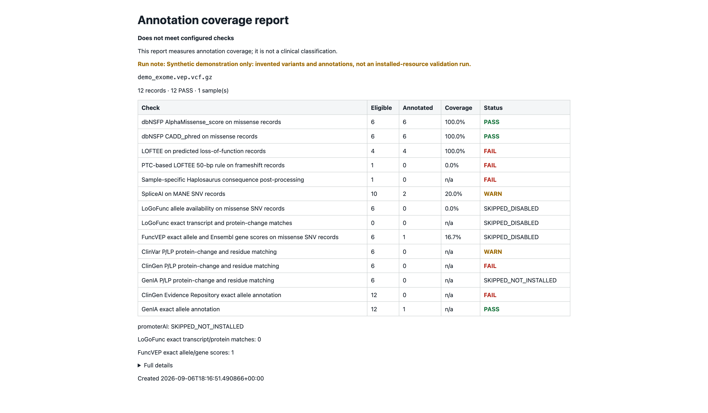

# Quality control and sanity checks

A technically plausible output may still be incomplete or incorrect.
GUIDE-IEI therefore provides several checks of annotation coverage and
software–dataset integration. These checks help identify missing or mismatched
annotations; they do not constitute clinical validation.

GUIDE-IEI's annotation checks do not assess raw-read quality, sequencing
coverage or callability, contamination, sample identity, or the upstream
variant caller. Those require separate laboratory and bioinformatic QC.

## Checks before annotation starts

The workbench preflight checks the input header and first record. The annotation
runner then streams through the complete VCF before compression, indexing,
filtering, or liftover. This same validation runs when you start annotation from
the command line. It checks mandatory columns (including `INFO`), sample names,
record widths, FORMAT structure, and gzip integrity; it does not validate the
biological meaning of a variant. A large genome or cohort file can take time to
scan. Malformed files stop with a filename and line-number diagnostic, without
printing patient records. Request a complete, valid export rather than editing
or discarding the offending rows blindly.

GUIDE-IEI also checks that the configured container can read the input and the
selected annotation references, and that writes to its output/work folder are
visible on the host. The probes stay local and remove their temporary marker
files. See [file-sharing troubleshooting](../FAQ.md#why-does-annotation-say-the-container-cannot-access-a-file-that-exists-on-my-mac).

Annotation subprocesses disable core dumps. A crashed command still fails and
reports an error; disabling a core dump does not turn a failure into success.

## The annotation coverage report

Every completed run writes two files beside the output VCF: a
machine-readable `*.annotation_qc.json` and a human-readable
`*.annotation_qc.html`. Open the HTML after any run that matters.

The report presents **coverage per annotation source, each against its
appropriate denominator** — AlphaMissense and CADD against missense
records, LOFTEE against predicted-LoF records, SpliceAI against the MANE
SNVs it can score — so "95% coverage" means 95% of the records that source
*should* have annotated, not a diluted whole-file average. It also records
the resource versions used, ClinVar matches, repeat/segdup overlap counts,
and concrete examples of any missing annotations.

A **WARN** means annotation coverage needs review — a dataset may be
missing, stale, or mismatched. It never removes variants and never implies
anything about pathogenicity. Typical causes, in order: a dataset not
installed, a dataset installed after the run (re-run to pick it up), or an
input whose variants fall outside a source's scope.



This screenshot intentionally uses incomplete, invented annotations to show
different report states; it is not an example of a validated installation.
A row can show 100% numeric coverage and still fail a required schema check
(for example, missing LOFTEE fields). Open **Full details** rather than judging
the result from the percentage alone.

## The regression panel

One command answers "is my installation annotating correctly?":

```bash
bash scripts/run_annotation_regression.sh
```

It annotates eight public GRCh38 control variants (known missense,
frameshift, splice-donor, stop-gained, and promoter alleles in NCSTN,
STAT3, IL2RG, TERT, and OR4F5). Assertions cover selected LOFTEE/PTC,
AlphaMissense, CADD, SpliceAI, ClinVar, and protein-match examples, plus optional
LoGoFunc and PromoterAI controls. It does not test every optional predictor or
every clinical source. Optional checks in this panel report `SKIP` when their
fields are absent; that is not evidence of a validated installation. The annotation QC
report separately records whether ClinVar, ClinGen, and GenIA protein matching
was evaluated, plus each source's same-change and same-residue hit counts. The
input contains one synthetic sample and no patient data.

Run it after first setup, after any dataset update, and whenever a result
makes you doubt the installation.

## Plausible magnitudes

The following ranges are practical reference points, not acceptance criteria.
Counts vary with capture design, ancestry, sequencing method, caller,
filtering, and annotation completeness.

These examples refer to **one sample** and variant sites, not transcript rows
or a multi-sample callset. One record with two ALT alleles, five transcripts
per ALT, and three carriers can expand into many review rows. An 88-sample
exome can legitimately contain far more records than one exome. Check sample
count, unique alleles, transcript expansion, and carrier calls separately
before deciding that a count is implausible.

| Stage | Exome | Genome |
|---|---|---|
| PASS variants in the VCF | tens of thousands | ~4–5 million |
| After Compact WGS prefilter | — | tens of thousands (a real example: ~4.3 M → ~23,000) |
| Rare (popmax ≤ 0.01) HIGH-impact | dozens | dozens |
| Rare HIGH + MODERATE | low hundreds | a few hundred |

**When to stop and investigate rather than interpret:**

- **Implausibly few** — a genome showing only a handful of rare
  protein-altering variants is a broken filter or a data problem, not a
  clean genome. A contig-naming mismatch between input and reference
  files, for example, can silently empty a filter route while the run
  completes without error; the implausible count is the only visible
  symptom.
- **Implausibly many** — tens of thousands of rare HIGH-impact calls
  usually means a build mismatch (GRCh37 data annotated as GRCh38), a
  frequency source that failed to attach, or non-PASS records included.
- **A blank column** — if an entire annotation column is empty, check the
  annotation coverage report and dataset readiness before anything else.

**The checklist when numbers look wrong:** open the annotation coverage report → check
dataset readiness on the setup screen → confirm the input's genome build →
run the regression panel → re-run the setup check
(`bash scripts/setup_environment.sh`). Each step localizes the problem
further; together they cover the failure modes seen in practice.
